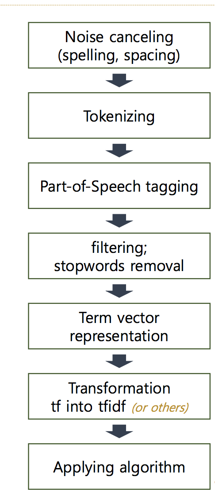
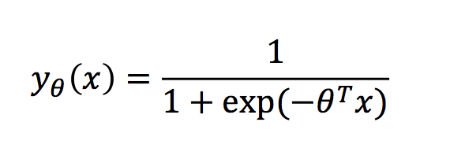

# 20180902 정리 자료
* 자연어 처리 딥러닝 목적
    - 데이터 분석을 위한 수작업의 양을 최소한으로 줄여 효율적인 한국어 텍스트 분석을 하는것
* 실습은 jupyter notebook 이용

[1week] 
* 각 벡터는 “의미 공간”에서의 좌표값 역할을 합니다. 
* 대부분 머신러닝 알고리즘은 벡터 공간에 작동하도록 설계 
* 군집화 : 비슷한 데이터를 하나의 집합으로 그룹화  
* Bag of words model : 문서 및 텍스트를 단어로 쪼개 한 가방 (Bag) 에 넣고 흔들어 섞은 뒤에 단어를 재정렬하는것과 비슷한 개념 
    - Bag of words model 에는 Euclidean 보다 Cosine 이 적절합니다 
* Cosine distance : 참고 URL : http://euriion.com/?p=548 
* Classification : 데이터 간의 경계 
* Keyword extraction(키워드 추출) : 
#### Text Data Processing Framework
 
* Spelling(오타)->전처리 단계
    - 사전에 존재하는 올바른 단어로 수정(FastText, Edit distance)
    - 오자는 수기로 입력된 데이터에서 자주 발생
* spacing(띄어쓰기)->전처리 단계
    - 띄어쓰기 오류 교정이 필요
    - 띄어쓰기 오류에 대응할 수 있는 토크나이저 개발
* Tokenizing
    - 설명 : 어절에서 단어를 나누는 것 , “문장”을 “토큰”으로 나누는 것
* Part-of-Speech(POS) tagging
    - 설명 : 품사 판별
    - Morphological analysis(형태소 분석)
        + 형태소 분석을 바탕으로 단어의 품사를 추정할 수 있음
* Stopwords removal
    - min count 기준 커팅(별로 나오지 않는 단어 제거)
    - 조사 제거
* Term vector representation
    - Term weighting(단어의 중요도)
    - TFIDF, BM25 등...
#### Text data processing
* 품사 판별 / 형태소분석은 KoNLPy 이용할 예정
* 형태소 분석기 마다 태그의 수준과 표기법이 다름
* Out of vocabulary(사전 이외에 단어는 어떻게 할건지?)
* 단어 사전 구축 필요
* 형태소분석vs품사판별
    - 형태소 분석은 단어의 구조까지 파악하며, 품사 판별은 품사를 인식
    - 형태소 분석은 단어의 구성 요소들을 분해하여 인식하는 과정
    - 품사 판별을 위하여 형태소 분석이 이용될 수 있음
#### Logistic Regression
* 대표적인 binary classification 알고리즘
 
* 일반적인 LR은 두 클래스의 경계면을 학습한다고 표현
* sklearn.linear에 라이브러리를 이용해서 LR import(python)
* Coefficients/계수(용어): 2x에서 x를 계수라 함
#### n-gram 추출
* unigram, bigram, ngram
* document classification은 bigram + linear model 이면 충분??
* 한국어에서 의미있는 n-gram은 품사 정보를 이용하는 것이 좋다.
    
